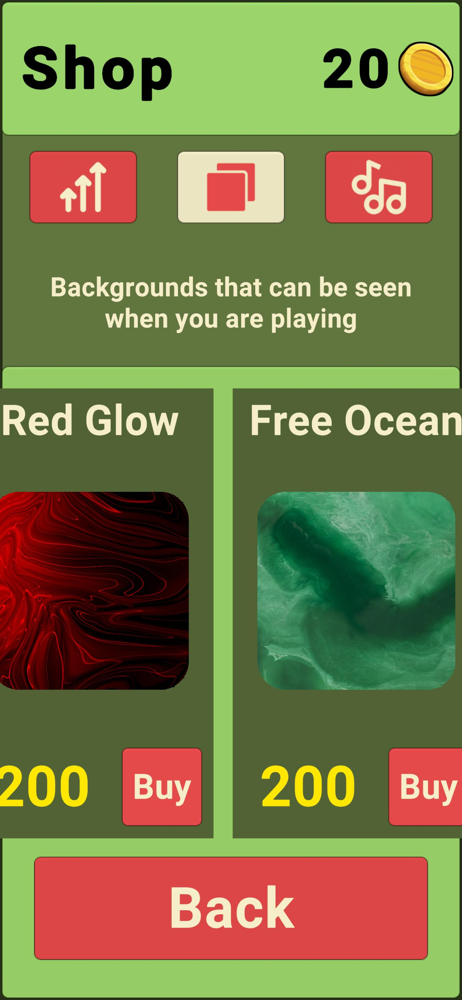
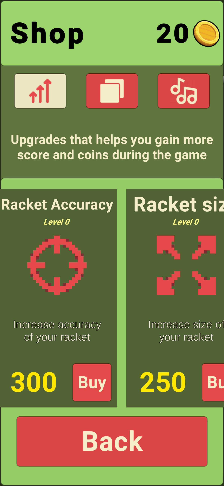
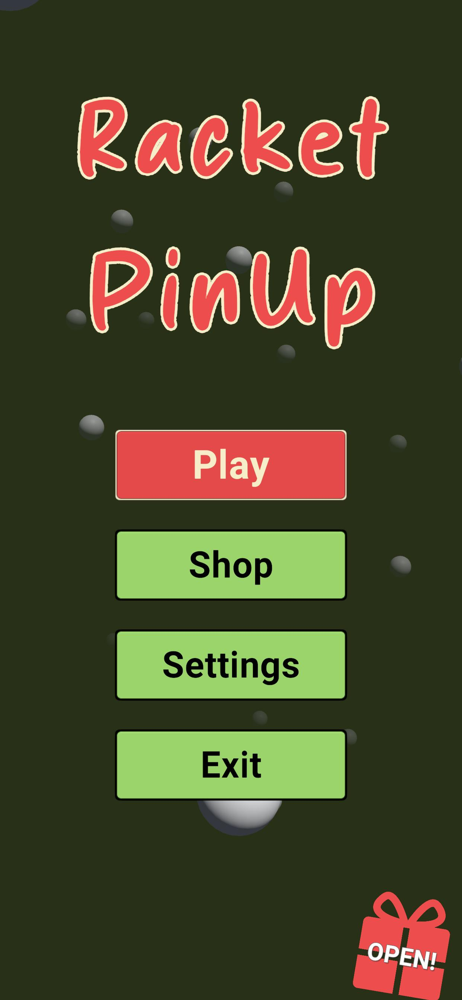
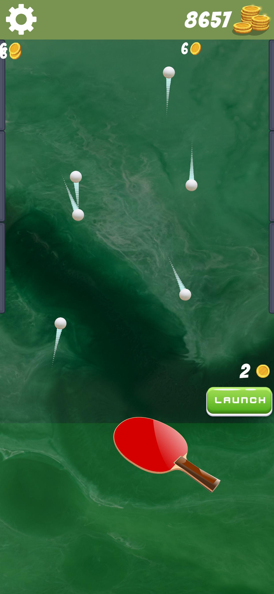
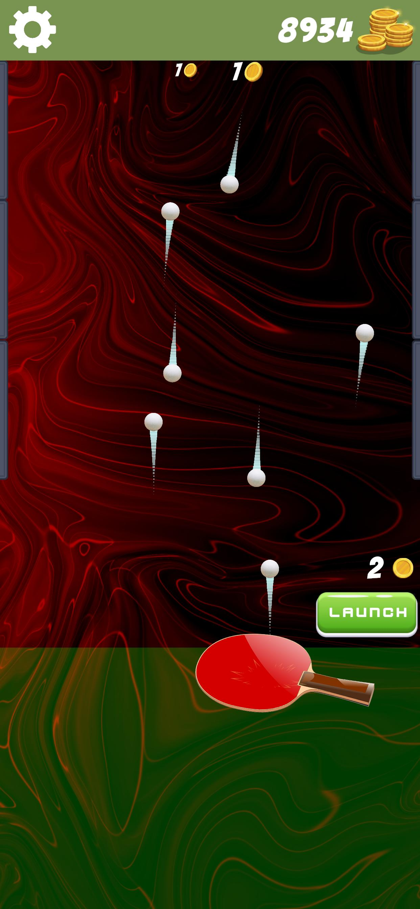
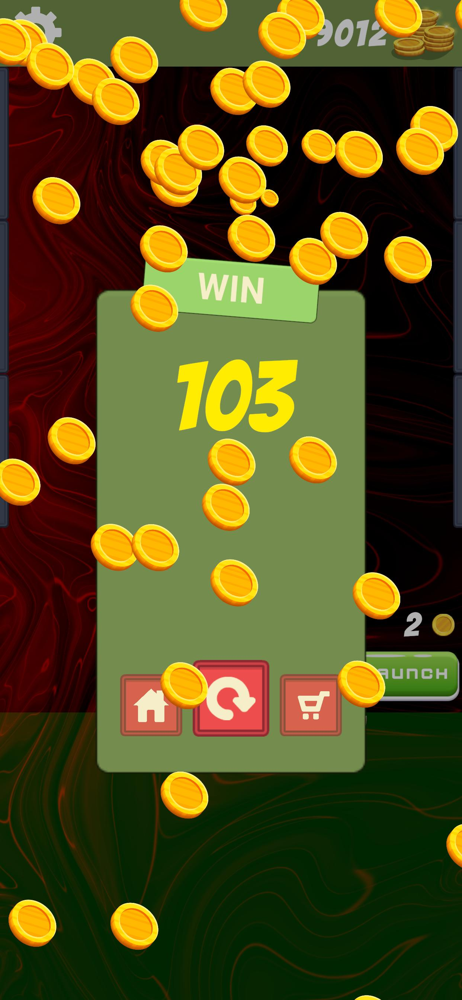
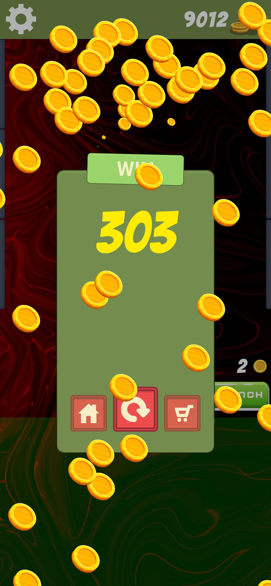

# Racket PinUp

Welcome to **Racket PinUp**, a fast-paced mobile arcade game where you control a paddle to keep balls flying upward and bouncing off the top wall! The more balls you juggle at once — the more coins you earn!

> This game was developed during my time at a game development company. All programming was done by me.

---

## Gameplay

- Tap and swipe to **move the racket**.
- Keep the balls bouncing off the top wall.
- The more balls you juggle **at the same time**, the more money you earn!
- But be careful — if balls fly off the sides, they’re gone!

---

## Upgrades & Customization

Earn coins and spend them on powerful upgrades and visual enhancements:

### Upgrades
- **Racket Speed** – Move faster and reach more balls.
- **Racket Size** – Increase the surface area of your paddle.
- **Racket Accuracy** – Boost ball control and stability.
- **Side Walls** – Prevent balls from flying out of bounds.

### Cosmetics
- **Music Packs** – Unlock new soundtracks.
- **Background Themes** – Customize the game’s look.

---

## Free Gifts

Every 15 minutes you’ll receive a free **coin reward** — just log in and grab your gift!

---

## Screenshots

    
    
    
    
    
    
  

---

## Platform

- Android

---

## Tech Stack

- Unity (C#)
- Custom physics & upgrade systems
- Fully responsive for mobile devices

---

## Contact

Feel free to reach out if you have questions, feedback, or just want to chat about game dev!
